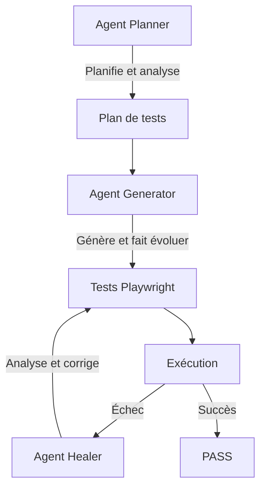
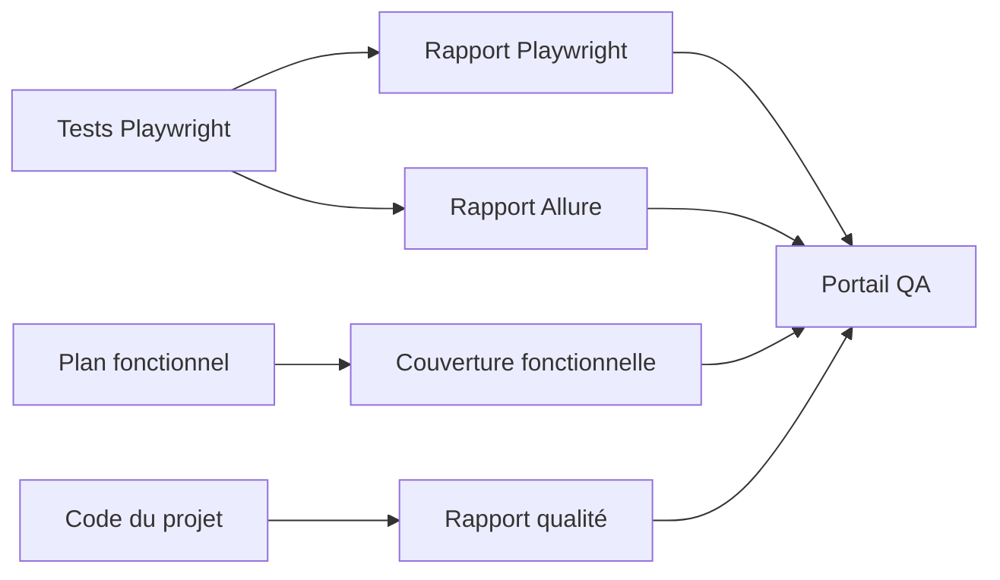
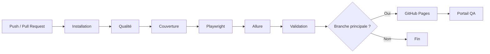
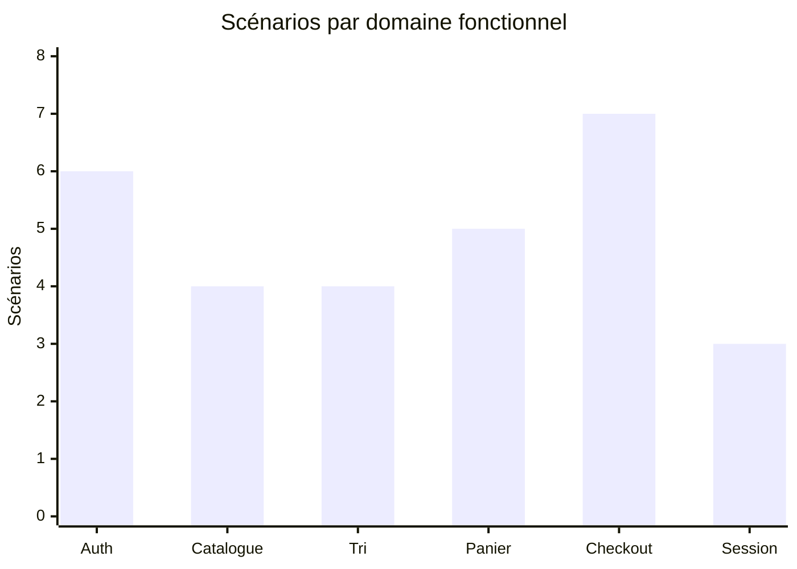
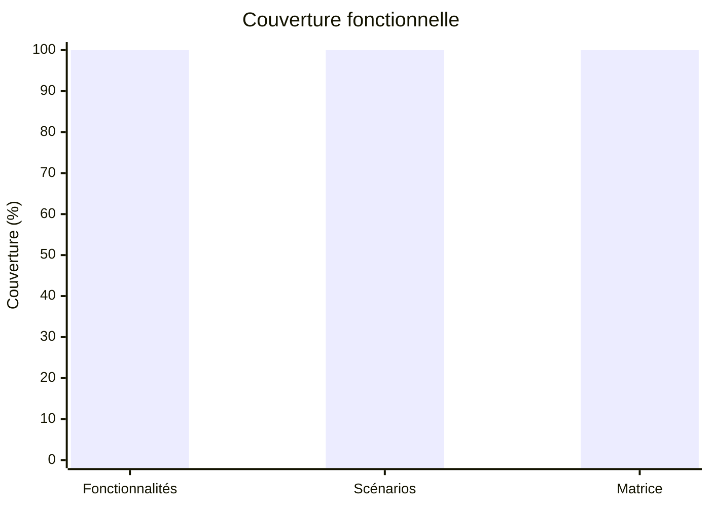
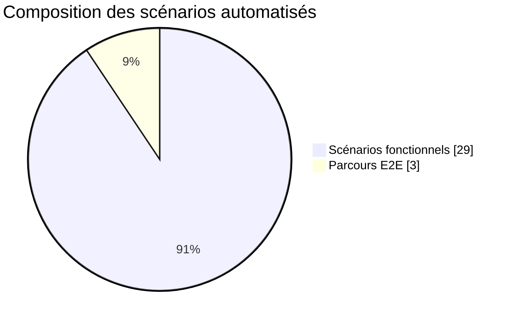

# Sprint Review — SauceDemo Playwright Agents

## 1. Présentation du projet

**SauceDemo Playwright Agents** est un projet open source d'entraînement à l'automatisation des tests d'une application web avec **Playwright et TypeScript**.

L'objectif est de mettre en œuvre une démarche QA complète autour de l'application publique **SauceDemo**, depuis l'identification du périmètre fonctionnel jusqu'à l'exécution automatisée des tests, leur maintenance, leur intégration continue et la publication des résultats.

Le projet explore également l'utilisation d'**agents IA avec Codex CLI et Playwright** pour assister différentes activités du cycle d'automatisation :

* planification des tests ;
* génération des tests ;
* maintenance et réparation des tests.

> La couverture présentée dans ce projet correspond au **périmètre fonctionnel défini pour cet exercice**. Elle ne représente ni une couverture exhaustive de SauceDemo, ni une couverture du code source de l'application.

---

# 2. Objectifs et portée

## Objectifs

Les principaux objectifs étaient de :

* construire un projet Playwright maintenable en TypeScript ;
* identifier les fonctionnalités principales de SauceDemo ;
* concevoir un plan de tests fonctionnels structuré ;
* automatiser les scénarios passants, non passants et les cas d'erreur ;
* mettre en place des parcours E2E représentatifs ;
* structurer le code avec un Page Object Model et des fixtures ;
* classifier les tests afin de permettre plusieurs stratégies d'exécution ;
* expérimenter l'utilisation d'agents IA spécialisés ;
* produire plusieurs niveaux de reporting QA ;
* automatiser les contrôles qualité ;
* intégrer les tests dans une pipeline CI ;
* publier les rapports dans un portail QA accessible publiquement.

---

## Périmètre fonctionnel

Six domaines fonctionnels principaux ont été retenus :

| Domaine          | Nombre de scénarios |
| ---------------- | ------------------: |
| Authentification |                   6 |
| Catalogue        |                   4 |
| Tri              |                   4 |
| Panier           |                   5 |
| Checkout         |                   7 |
| Session          |                   3 |
| **Total**        |              **29** |

Les scénarios couvrent plusieurs types de comportements :

* cas passants ;
* cas non passants ;
* cas d'erreur ;
* scénarios Smoke ;
* scénarios de régression.

Trois parcours E2E supplémentaires permettent de vérifier des chaînes fonctionnelles plus larges.

---

# 3. Résultats du périmètre automatisé

| Indicateur                                 |    Résultat |
| ------------------------------------------ | ----------: |
| Fonctionnalités couvertes                  |   **6 / 6** |
| Scénarios fonctionnels automatisés         | **29 / 29** |
| Matrice fonctionnelle                      | **18 / 18** |
| Parcours E2E                               |       **3** |
| Tests Playwright                           |      **32** |
| Couverture du périmètre fonctionnel défini |   **100 %** |

La couverture fonctionnelle de 100 % signifie que l'ensemble des fonctionnalités et scénarios retenus dans le plan de tests de ce projet disposent d'une automatisation Playwright.

---

# 4. Méthodologie

La réalisation du projet a suivi une approche progressive.

```mermaid
flowchart LR
    A[Exploration de SauceDemo] --> B[Définition du périmètre]
    B --> C[Plan de tests fonctionnels]
    C --> D[Architecture Playwright]
    D --> E[Automatisation]
    E --> F[Tests E2E]
    F --> G[Contrôles qualité]
    G --> H[Reporting]
    H --> I[CI/CD]
    I --> J[Portail QA]
```



## 4.1 Exploration fonctionnelle

L'application SauceDemo a d'abord été explorée afin d'identifier ses principales fonctionnalités et ses différents comportements.

Cette phase a permis d'identifier :

* les parcours nominaux ;
* les contrôles de saisie ;
* les comportements d'erreur ;
* les comportements spécifiques de certains utilisateurs de démonstration ;
* les interactions entre les différentes pages.

---

## 4.2 Construction du plan de tests

Un plan fonctionnel a ensuite été construit autour des six domaines identifiés.

Chaque scénario possède un identifiant `TC-*`, permettant de conserver une organisation claire entre le plan et les tests automatisés.

Exemples :

```text
TC-AUTH-01
TC-CAT-01
TC-TRI-01
TC-PAN-01
TC-CHK-01
TC-SESSION-01
```

Cette organisation facilite la lecture du projet et l'identification de la couverture automatisée.

---

## 4.3 Classification des tests

Les tests utilisent des tags permettant de constituer différentes suites d'exécution.

### Type de scénario

```text
@positive
@negative
@error
```

### Niveau d'exécution

```text
@smoke
@regression
@e2e
```

### Domaine fonctionnel

```text
@auth
@catalog
@sorting
@cart
@checkout
@session
```

Cette stratégie permet par exemple d'exécuter rapidement les tests Smoke ou de lancer une campagne de régression plus complète.

---

## 4.4 Architecture de l'automatisation

Le projet repose sur une séparation entre :

* spécifications ;
* Page Objects ;
* fixtures ;
* scénarios E2E ;
* reporting.

```text
tests/
├── fixtures/
│   └── test-fixtures.ts
├── pages/
│   ├── login.page.ts
│   ├── inventory.page.ts
│   ├── cart.page.ts
│   └── checkout.page.ts
└── specs/
    ├── e2e/
    ├── plan-tests-fonctionnels-saucedemo.md
    ├── auth.spec.ts
    ├── inventory.spec.ts
    ├── sorting.spec.ts
    ├── cart.spec.ts
    ├── checkout.spec.ts
    └── session.spec.ts
```

Le **Page Object Model** centralise les interactions avec l'interface et évite de disperser les locators et les actions dans les tests.

Les **fixtures Playwright** permettent de mutualiser certains prérequis, notamment la création d'un contexte utilisateur authentifié.

---

# 5. Utilisation des agents IA

Une partie importante du projet consistait à expérimenter l'utilisation d'agents IA spécialisés dans un véritable workflow d'automatisation.

Trois rôles ont été utilisés.



### Planner

Utilisé pour explorer, analyser et structurer la stratégie de tests.

### Generator

Utilisé pour générer ou faire évoluer les tests et certains composants du projet à partir d'instructions contrôlées.

### Healer

Utilisé pour analyser et réparer un test devenu défaillant.

Le fonctionnement du Healer a notamment été vérifié volontairement en introduisant un locator incorrect dans un Page Object puis en lui demandant d'identifier et de corriger la régression.

L'objectif n'était pas de remplacer la démarche QA par l'IA, mais d'expérimenter son utilisation comme **outil d'assistance au développement et à la maintenance des tests**.

---

# 6. Outils et technologies

| Technologie                  | Utilisation                                  |
| ---------------------------- | -------------------------------------------- |
| **Playwright**               | Automatisation des tests web                 |
| **TypeScript**               | Développement du framework de tests          |
| **Node.js / npm**            | Environnement et gestion des dépendances     |
| **Codex CLI**                | Assistance IA en ligne de commande           |
| **Playwright MCP**           | Interaction des agents avec le navigateur    |
| **Page Object Model**        | Organisation des interactions avec les pages |
| **Fixtures Playwright**      | Mutualisation des prérequis                  |
| **Allure**                   | Reporting détaillé des exécutions            |
| **Playwright HTML Reporter** | Rapport natif Playwright                     |
| **ESLint**                   | Analyse statique du code                     |
| **Prettier**                 | Normalisation du formatage                   |
| **Git**                      | Gestion de versions                          |
| **GitHub**                   | Hébergement du projet                        |
| **GitHub Actions**           | Intégration continue                         |
| **GitHub Pages**             | Publication du portail QA                    |

---

# 7. Stratégie de reporting

Le projet ne se limite pas au résultat d'une commande Playwright.

Plusieurs niveaux de reporting ont été mis en place :



Le portail QA centralise :

* la couverture fonctionnelle ;
* les résultats Playwright ;
* le rapport Allure ;
* les contrôles qualité.

Il constitue le point d'entrée principal pour consulter l'état du projet.

---

# 8. Intégration continue

Une pipeline **GitHub Actions** automatise les principales validations du projet.

Elle prend notamment en charge :

1. l'installation des dépendances ;
2. les contrôles qualité ;
3. la génération du rapport de couverture ;
4. l'installation de Chromium ;
5. l'exécution des tests Playwright ;
6. la génération du rapport Allure ;
7. la validation des rapports ;
8. la consolidation des artefacts ;
9. le contrôle final de la pipeline ;
10. la publication sur GitHub Pages.



Cette automatisation permet d'obtenir un retour reproductible à chaque évolution du projet.

---

# 9. Défis rencontrés

## 9.1 Structurer un projet au-delà de simples scripts

### Défi

Un premier risque était de produire uniquement une collection de fichiers `.spec.ts` sans architecture globale.

### Solution

Le projet a été structuré progressivement autour de :

* Page Objects ;
* fixtures ;
* tags ;
* scénarios fonctionnels ;
* parcours E2E ;
* reporting ;
* CI/CD.

### Enseignement

L'automatisation ne se résume pas à écrire des tests qui passent. La maintenabilité et l'organisation du framework sont essentielles.

---

## 9.2 Gérer les comportements particuliers de SauceDemo

### Défi

SauceDemo fournit plusieurs utilisateurs de démonstration ayant volontairement des comportements différents.

Certains comportements observés ne correspondent donc pas nécessairement au fonctionnement nominal attendu d'une application e-commerce.

### Solution

Les comportements ont été observés avant l'automatisation et les assertions ont été construites à partir du périmètre réellement étudié.

Les scénarios distinguent ainsi les parcours nominaux des comportements d'erreur ou spécifiques aux utilisateurs de démonstration.

### Enseignement

Un test automatisé doit vérifier un comportement compris et documenté, et non simplement reproduire une suite de clics.

---

## 9.3 Maintenir des locators fiables

### Défi

Une automatisation UI dépend fortement de la stabilité des locators.

### Solution

Les locators ont été centralisés dans les Page Objects et les sélecteurs Playwright adaptés ont été privilégiés, notamment les rôles, attributs de test et libellés accessibles.

Le Healer a également été testé sur une régression volontaire de locator.

### Enseignement

La centralisation des locators réduit le coût de maintenance lorsqu'une interface évolue.

---

## 9.4 Trouver le bon niveau d'utilisation de l'IA

### Défi

L'utilisation d'agents IA peut rapidement conduire à générer trop de code ou à complexifier inutilement l'architecture.

### Solution

Les agents ont reçu des rôles précis et des instructions écrites dans des prompts versionnés.

Les décisions fonctionnelles et architecturales sont restées contrôlées par le projet.

### Enseignement

L'IA est particulièrement utile lorsqu'elle intervient dans un cadre défini, avec un périmètre clair et des validations systématiques.

---

## 9.5 Construire une mesure de couverture pertinente

### Défi

Le code source de SauceDemo n'appartient pas au projet. Une métrique classique de couverture de lignes ou de branches n'aurait donc pas représenté la qualité du périmètre automatisé.

### Solution

Une mesure de **couverture fonctionnelle** a été construite à partir du plan de tests et des scénarios automatisés.

### Enseignement

Une métrique doit toujours être accompagnée de sa définition. Dans ce projet, `100 %` signifie que **100 % du périmètre fonctionnel défini est automatisé**, et non que 100 % de l'application ou de son code source est couvert.

---

## 9.6 Industrialiser le reporting

### Défi

Playwright fournit déjà un excellent rapport HTML, mais le projet avait besoin d'une vue plus globale réunissant exécution, couverture et qualité.

### Solution

Plusieurs rapports ont été générés puis centralisés dans un portail QA publié automatiquement.

### Enseignement

Le reporting est une partie importante de l'automatisation : un résultat doit pouvoir être compris rapidement par une personne qui n'a pas exécuté les tests elle-même.

---

# 10. Preuves visuelles

## 10.1 Répartition des scénarios fonctionnels



Le Checkout représente le domaine comportant le plus de scénarios, suivi de l'authentification et du panier.

---

## 10.2 Couverture du périmètre



Les trois indicateurs atteignent 100 % sur le périmètre défini :

* 6 fonctionnalités sur 6 ;
* 29 scénarios sur 29 ;
* 18 combinaisons fonction/type sur 18.

---

## 10.3 Composition de la suite automatisée



La suite contient **32 tests Playwright**, dont 29 scénarios fonctionnels et 3 parcours E2E complémentaires.

Les parcours E2E sont suivis séparément et ne viennent pas augmenter artificiellement les 29 scénarios du périmètre fonctionnel.

---

# 11. Résultats

À l'issue du projet :

* les **6 fonctionnalités principales identifiées** sont couvertes ;
* les **29 scénarios fonctionnels définis** sont automatisés ;
* la matrice Passant / Non passant / Erreur du périmètre est couverte ;
* **3 parcours E2E** complètent la validation fonctionnelle ;
* le framework utilise des **Page Objects et fixtures** ;
* plusieurs stratégies d'exécution sont disponibles grâce aux tags ;
* les contrôles **ESLint et Prettier** sont intégrés ;
* les rapports **Playwright, Allure, Couverture et Qualité** sont disponibles ;
* une pipeline **GitHub Actions** automatise les validations ;
* les résultats sont publiés dans un **portail QA GitHub Pages** ;
* des **agents IA spécialisés** ont été intégrés au workflow de développement et de maintenance.

---

# 12. Enseignements

Ce projet a permis de travailler l'automatisation comme une véritable démarche QA plutôt que comme une simple activité de scripting.

Les principaux enseignements sont les suivants :

### Concevoir avant d'automatiser

L'identification du périmètre et la construction du plan de tests permettent de savoir précisément ce qui est couvert et pourquoi.

### Séparer les responsabilités

Les Page Objects, fixtures et fichiers de spécification rendent le framework plus lisible et facilitent sa maintenance.

### Tester plusieurs dimensions

Les scénarios nominaux seuls ne suffisent pas. Les cas non passants et les comportements d'erreur sont essentiels pour obtenir une couverture fonctionnelle pertinente.

### Garder les E2E ciblés

Les parcours E2E complètent les tests fonctionnels sans dupliquer inutilement tous les scénarios.

### Automatiser aussi la qualité du projet de tests

ESLint, Prettier et la CI permettent de contrôler le framework lui-même, et pas uniquement l'application testée.

### Rendre les résultats visibles

Les rapports et le portail QA permettent de transformer les résultats techniques en informations immédiatement consultables.

### Utiliser l'IA comme accélérateur

Les agents peuvent assister la planification, la génération et la maintenance, mais leur travail doit rester guidé par des instructions précises et validé par l'exécution des tests et les contrôles qualité.

### Éviter la sur-complexité

Un projet d'entraînement doit rester compréhensible. Chaque nouvelle couche doit apporter une valeur réelle à la démonstration.

---

# 13. Bilan

Le projet démontre une chaîne QA automatisée complète :

```text
Analyse fonctionnelle
        ↓
Plan de tests
        ↓
Automatisation Playwright
        ↓
Page Object Model / Fixtures
        ↓
Smoke / Régression / E2E
        ↓
Qualité du code
        ↓
Reporting
        ↓
CI/CD
        ↓
Portail QA
```

Le résultat est un projet open source reproductible permettant de démontrer à la fois des compétences en :

* analyse et conception de tests ;
* automatisation Playwright ;
* TypeScript ;
* architecture de framework ;
* stratégie de tests ;
* CI/CD ;
* reporting QA ;
* utilisation encadrée d'agents IA pour l'automatisation.

---

## Liens

**Dépôt GitHub :**
https://github.com/maximejoannis/saucedemo-playwright-agents

**Portail QA :**
https://maximejoannis.github.io/saucedemo-playwright-agents/

**Application testée :**
https://www.saucedemo.com/
