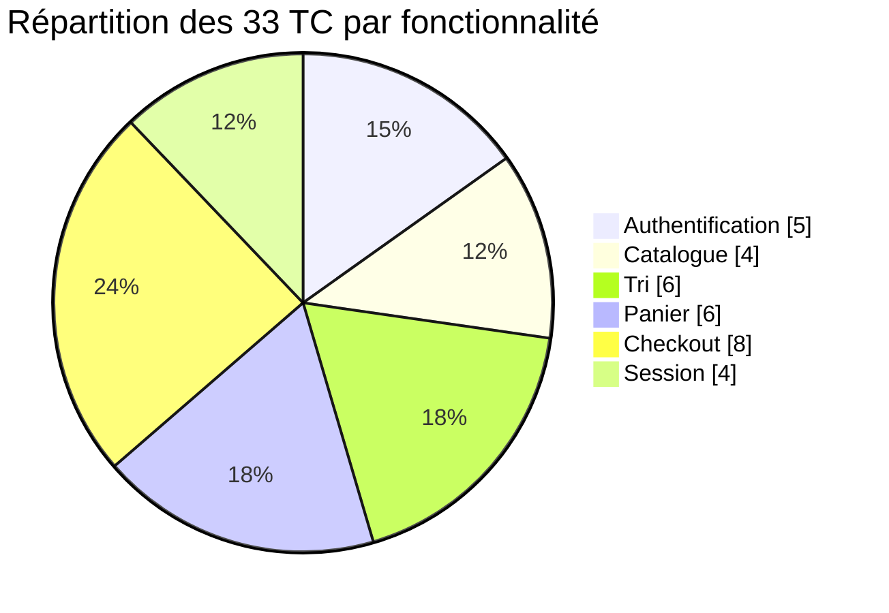
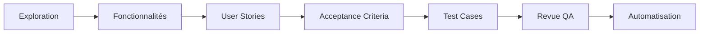
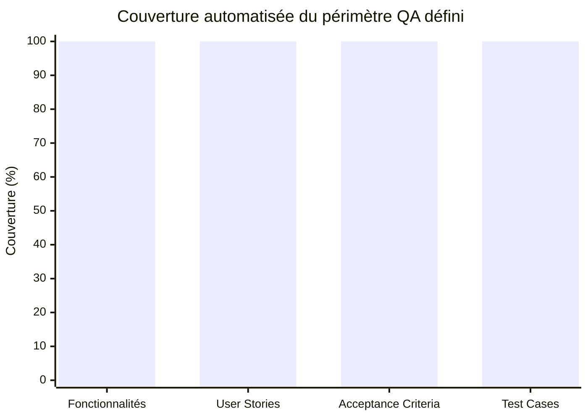
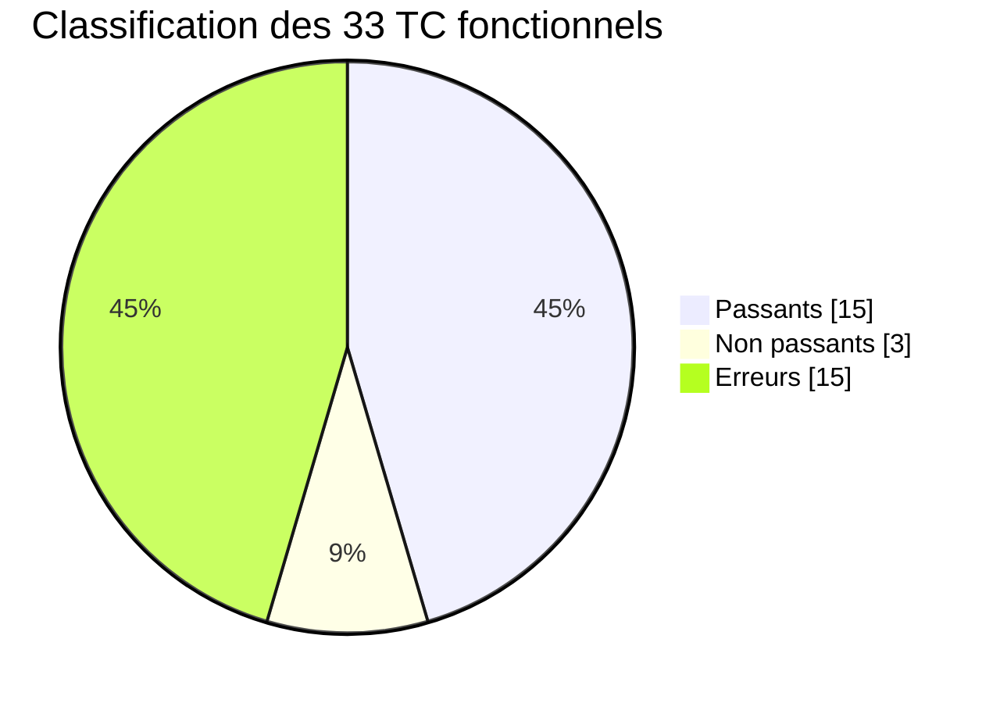
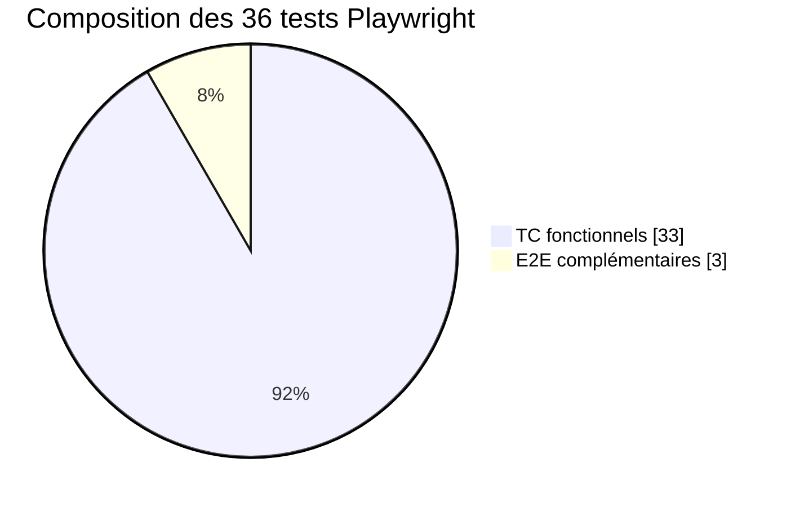
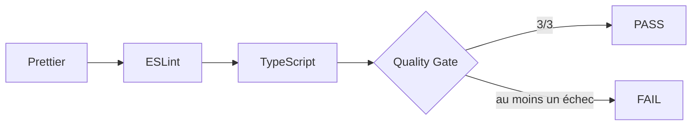
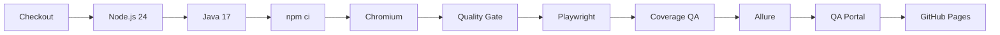
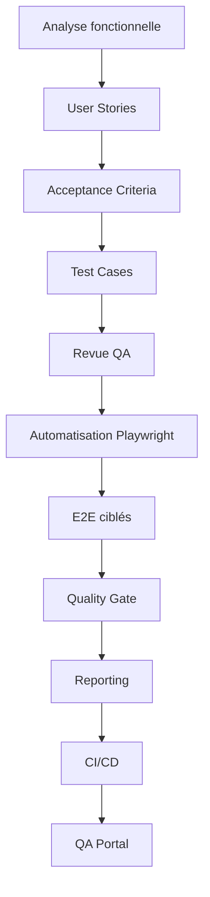

# Sprint Review — SauceDemo Playwright Agents

## 1. Synthèse de la réalisation

**SauceDemo Playwright Agents** met en œuvre une démarche de QA Automation complète sur l’application publique [SauceDemo](https://www.saucedemo.com/). La réalisation relie la conception fonctionnelle à l’automatisation, puis aux mécanismes de contrôle et de publication.

```text
Fonctionnalité → User Story → Acceptance Criteria → Test Case → Playwright
→ E2E → Reporting → Quality Gate → CI/CD → QA Portal
```

Cette Sprint Review complète le [README](README.md) : le README présente le projet et son utilisation, tandis que ce document détaille les décisions QA, les résultats, les difficultés et les enseignements.

> La couverture de 100 % désigne la couverture automatisée du **périmètre QA défini et documenté**. Elle ne représente ni l’ensemble de SauceDemo, ni une couverture exhaustive de l’application, ni une couverture du code source.

## 2. Résultats finaux

| Indicateur                           |    Résultat |
| ------------------------------------ | ----------: |
| Fonctionnalités couvertes            |         6/6 |
| User Stories couvertes               |         6/6 |
| Acceptance Criteria couverts         |       32/32 |
| TC fonctionnels automatisés          |       33/33 |
| TC passants / non passants / erreurs | 15 / 3 / 15 |
| Priorités P0 / P1 / P2               |  5 / 26 / 2 |
| E2E complémentaires                  |           3 |
| Tests Playwright globaux             |          36 |
| Couverture du périmètre QA défini    |       100 % |
| Quality Gate                         |    3/3 PASS |

Les 36 tests Playwright se composent de **33 TC fonctionnels** issus de la conception et de **3 E2E complémentaires**. Les E2E ne sont pas comptés comme de nouveaux TC, de nouvelles User Stories ou de nouveaux Acceptance Criteria.

## 3. Périmètre fonctionnel

Six domaines ont été retenus après exploration. La consultation d’une fiche produit appartient au Catalogue et les actions du menu à la Session ; aucun domaine artificiel n’a été ajouté.

| Fonctionnalité   | User Story | Acceptance Criteria | TC fonctionnels |
| ---------------- | ---------- | ------------------: | --------------: |
| Authentification | US-01      |                   5 |               5 |
| Catalogue        | US-02      |                   4 |               4 |
| Tri              | US-03      |                   6 |               6 |
| Panier           | US-04      |                   5 |               6 |
| Checkout         | US-05      |                   8 |               8 |
| Session          | US-06      |                   4 |               4 |
| **Total**        | **6 US**   |              **32** |          **33** |

AC-CART-05 est volontairement vérifié par deux TC distincts afin de caractériser les deux comptes spéciaux concernés.



## 4. Conception QA et traçabilité



Les User Stories expriment le besoin observable. Les Acceptance Criteria définissent ce qui doit être vérifié. Les TC `TC-*` transforment ces critères en validations reproductibles et automatisables, avec préconditions, données, étapes, résultats attendus, type, priorité et tags.

La [matrice de traçabilité](tests/requirements/traceability-matrix.md) est la source de contrôle entre les niveaux :

```text
Fonctionnalité → User Story → Acceptance Criteria → Test Case → Playwright
```

Elle est complétée par les [User Stories](tests/requirements/user-stories.md), les [Acceptance Criteria](tests/requirements/acceptance-criteria.md) et le [plan de tests fonctionnels](tests/test-plan/plan-tests-fonctionnels-saucedemo.md).

Le générateur Coverage échoue notamment en présence :

- d’identifiants dupliqués pour les fonctionnalités, US, AC, TC ou tests Playwright actifs ;
- d’une US sans fonctionnalité ou sans AC ;
- d’une référence US/AC inexistante ou incompatible ;
- d’un TC absent du plan, de la matrice ou de l’automatisation ;
- d’un test actif sans identifiant `TC-*` ou `E2E-*` reconnu ;
- d’une divergence entre références ou tags documentés et automatisés ;
- d’un AC non couvert ou non automatisé ;
- d’un TC placé dans la couche E2E, ou inversement ;
- d’un E2E comptabilisé comme TC fonctionnel.



## 5. Stratégie de tests

### 5.1 Classification fonctionnelle

| Nature      | Tag         | Nombre |
| ----------- | ----------- | -----: |
| Passant     | `@positive` |     15 |
| Non passant | `@negative` |      3 |
| Erreur      | `@error`    |     15 |
| **Total**   |             | **33** |



Les priorités sont réparties entre **5 P0**, **26 P1** et **2 P2**. La priorité exprime la criticité QA ; l’appartenance à une campagne Smoke ou Regression définit une stratégie d’exécution. Ce sont deux dimensions distinctes.

### 5.2 Smoke et Regression

| Campagne   | Fonctionnel | E2E | Playwright global |
| ---------- | ----------: | --: | ----------------: |
| Smoke      |           5 |   1 |                 6 |
| Regression |          33 |   3 |                36 |

La Smoke fonctionnelle couvre l’accès, le catalogue, l’ajout au panier, la commande et la déconnexion. Tous les TC fonctionnels appartiennent à la Regression.

### 5.3 Parcours E2E

1. **E2E-01 — achat complet** : Authentification → Catalogue → Panier → Checkout ;
2. **E2E-02 — blocage fonctionnel au checkout** : validation du nom manquant sans quitter l’étape d’informations ;
3. **E2E-03 — protection de session** : déconnexion puis refus d’une route protégée.



Les E2E vérifient les transitions entre domaines. Ils ne servent pas à augmenter artificiellement la couverture des TC fonctionnels.

## 6. Tests de caractérisation

Sept TC documentent volontairement des comportements dégradés observés avec `problem_user` et `error_user` : `TC-CAT-04`, `TC-TRI-05`, `TC-TRI-06`, `TC-PAN-05`, `TC-PAN-06`, `TC-CHK-07` et `TC-CHK-08`.

Ils caractérisent notamment des images dégradées, des tris inopérants, des ajouts partiels et des blocages au checkout. Ils ne décrivent pas les comportements nominaux attendus d’une application e-commerce et devront être reconfirmés si la démonstration publique évolue.

Le refus de connexion de `locked_out_user` est traité différemment : il correspond à la règle fonctionnelle attendue pour un compte verrouillé, et non à un test de caractérisation.

## 7. Architecture Playwright

```text
tests/
├── fixtures/
├── pages/
├── requirements/
├── specs/
│   └── e2e/
├── test-data/
└── test-plan/

reporting/
├── coverage/
├── quality/
├── qa-portal/
└── scripts/

.github/
└── workflows/
```

Le Page Object Model repose sur `LoginPage`, `InventoryPage`, `CartPage` et `CheckoutPage`. Les interactions et locators sont séparés des assertions métier. Les sélecteurs privilégient les attributs `data-test`, les rôles accessibles et le contexte d’un composant.

Les fixtures mutualisent la connexion nominale et les données de test centralisent utilisateurs et produits. Chaque test conserve un contexte indépendant ; l’architecture reste compatible avec `fullyParallel`, même si la CI limite actuellement l’exécution à un worker.

## 8. Agents Playwright / Codex et MCP

Les agents sont des outils intégrés au workflow QA, pas des substituts à la conception, à la revue ou aux contrôles automatisés.

- **Planner** : exploration, User Stories, Acceptance Criteria, Test Cases et revue de la conception QA ;
- **Generator** : architecture, automatisation des 33 TC, E2E, reporting, Quality Gate, portail et CI/CD ;
- **Healer** : revue de robustesse, analyse d’échec et correction ciblée.

La revue Healer de la suite finale a notamment renforcé l’ouverture du menu dans `InventoryPage` : après le clic, le Page Object attend explicitement que l’action Logout soit visible. Cette synchronisation réduit la fragilité des parcours Session lors des exécutions en parallèle.

Playwright MCP sert de support d’exploration et d’interaction navigateur pour les agents. La validation finale reste assurée par TypeScript, ESLint, Prettier, Playwright et GitHub Actions.

## 9. Reporting et Quality Gate

Quatre surfaces complémentaires sont centralisées dans le QA Portal :

- **Playwright Report** : rapport natif de l’exécution Chromium ;
- **Allure Report** : détail des suites, tests et résultats ;
- **Coverage QA** : couverture des fonctionnalités, US, AC, TC et automatisation — pas du code source ;
- **Quality Report** : résultat des contrôles Prettier, ESLint et TypeScript.



Le générateur exécute les trois contrôles, écrit un rapport détaillé et retourne un échec si au moins l’un d’eux échoue. **Playwright et Allure ne font pas partie des trois checks du Quality Gate** ; ils restent des validations CI distinctes.

Les tests produisent `allure-results/`. Le rapport HTML Allure est officiellement généré dans GitHub Actions avec Java 17. Java n’est pas requis pour exécuter localement les tests Playwright ; il est seulement nécessaire pour produire Allure HTML en local.

## 10. CI/CD et QA Portal

Le workflow [QA Pipeline](.github/workflows/qa.yml) utilise `actions/checkout@v4`, `actions/setup-node@v4` avec Node.js 24, Temurin Java 17, puis Chromium Playwright.



Les déclencheurs réels sont :

- Pull Request vers `main` : validation, génération des rapports et assemblage du portail, sans publication ;
- `push` sur `main` : validation complète puis publication GitHub Pages si le job QA réussit ;
- `workflow_dispatch` : lancement manuel de la validation, sans publication Pages puisque ce n’est pas un `push` sur `main`.

Les artefacts de diagnostic sont téléversés même en cas d’échec et conservés 30 jours. Le portail publié expose :

```text
/
├── playwright/
├── allure/
├── coverage/
└── quality/
```

La CI génère `site/portal-data.js` après assemblage. Le dashboard affiche les données de la **dernière exécution CI publiée** : branche, commit, date, résultats Playwright, Quality Gate et couverture QA. Il ne s’agit pas de données en temps réel.

## 11. Défis rencontrés et décisions

### Concevoir avant d’automatiser

Le principal changement méthodologique a consisté à formaliser fonctionnalités, US et AC avant les TC. Cela évite qu’une suite techniquement riche masque des exigences absentes ou une couverture difficile à justifier.

### Établir une traçabilité vérifiable

La matrice seule ne suffit pas si elle peut diverger du code. Le générateur Coverage relit les documents et les tests actifs, contrôle leurs références et échoue sur les incohérences détectées.

### Distinguer exigence et observation

Les comptes spéciaux exposent des comportements volontairement dégradés. Les qualifier comme tests de caractérisation permet de les surveiller sans les transformer en exigences nominales.

### Stabiliser les interactions UI

La centralisation des locators dans les Page Objects facilite leur revue. L’attente explicite de l’ouverture du menu dans `InventoryPage` répond à une fragilité de synchronisation visible sous parallélisation.

### Encadrer les agents IA

Les agents ont accéléré exploration, production et revue, mais chaque contribution a été confrontée aux sources documentaires, au typage, aux règles de qualité et à l’exécution Playwright.

### Mesurer sans accès au code applicatif

Sans accès au code source de SauceDemo, la métrique pertinente est la couverture du périmètre QA documenté. Elle est calculée à partir de la chaîne Fonctionnalité/US/AC/TC, jamais présentée comme couverture de code.

### Industrialiser la restitution

Il a fallu rendre cohérents quatre rapports, générer Allure avec Java 17 en CI, assembler un portail unique et y injecter les données de l’exécution publiée avant le déploiement GitHub Pages.

## 12. Enseignements

- **Concevoir avant d’automatiser** : Fonctionnalité → User Story → Acceptance Criteria → Test Case → automatisation.
- **Rendre la traçabilité exécutable** : les contrôles automatiques détectent les divergences que la lecture seule peut laisser passer.
- **Séparer les responsabilités** : Page Objects, fixtures, données, specs et reporting ont des rôles distincts.
- **Cibler les E2E** : quelques parcours transverses apportent de la valeur sans dupliquer les 33 TC.
- **Traiter le framework comme un produit** : typage, lint, formatage, robustesse et rapports participent à la qualité.
- **Encadrer l’IA** : Planner, Generator et Healer assistent le workflow ; les preuves restent dans le dépôt et la CI.
- **Éviter la sur-complexité** : l’architecture reste proportionnée à une application de démonstration et à son périmètre documenté.

## 13. Bilan



Le résultat final associe **6 fonctionnalités**, **6 User Stories**, **32 Acceptance Criteria**, **33/33 TC automatisés**, **3 E2E**, soit **36 tests Playwright**, une couverture de **100 % du périmètre QA défini**, un **Quality Gate 3/3 PASS**, une CI/CD GitHub Actions et un portail GitHub Pages.

## 14. Liens

- [Repository GitHub](https://github.com/maximejoannis/saucedemo-playwright-agents)
- [QA Portal](https://maximejoannis.github.io/saucedemo-playwright-agents/)
- [SauceDemo](https://www.saucedemo.com/)

---

Cette Sprint Review documente l’état final du périmètre QA à la date de sa réalisation. Toute évolution de SauceDemo ou de la suite doit conduire à régénérer les rapports et à réévaluer la traçabilité.
